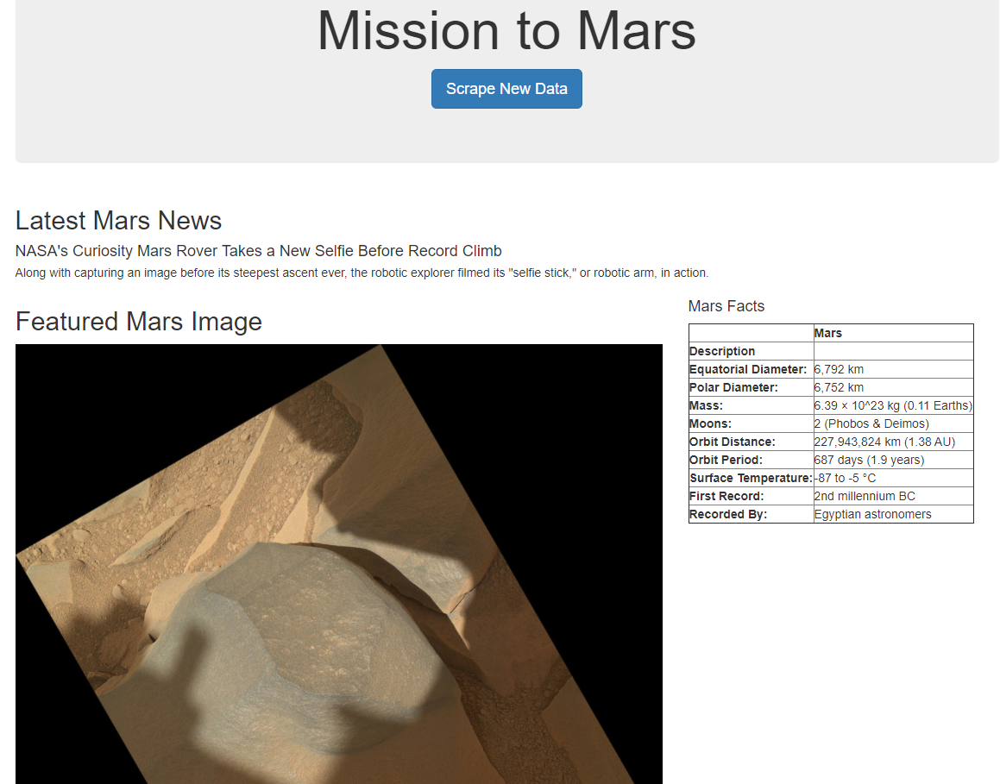

# Mission-to-Mars
Web Scraping to Extract Online Data:
Web scraping is a method used by organizations worldwide to extract online data for analysis. Large companies employ web scraping 
to assess their reputations or track their competitors’ online presence.

## Project Overview 
In this project, a web browser is automated to visit different websites to extract data about the "Mission to Mars". Scraped data was 
stored in a NoSQL database, and then rendered in a web application created with Flask.

In this project, a wed page has been designed using the live scrapped data about 
Mars planet from different NASA/gov websites.The images of four Mars Hemispheres have
also been included in the web page.

## Tools
HTML, BeautifulSoup, Splinter, MongoDB, Flask, CSS, Bootstrap 

## Summary 
A wed page has been designed using the live scrapped data about Mars planet from different NASA/gov websites.
The images of four Mars Hemispheres have also been included in the web page.

### How to run the code:
- Clone the repository to your local computer, python
- This app is designed for Windows users, refer to scraping.py file.
- Open you terminal.
- 'cd' into the directory that holds the repo.
- Run the command "python scraping.py".
- Run the command "python app.py".
- Open your browser and go to "http://127.0.0.1:5000/".
- Click the "Scrap New Data" Button on the web page. It will take about a few moments for the scraping to complete.
- It will lead you to another web page, click "Get To Index" Button to see updated data which will be displayed on the webpage.

## Webpage

Mars Four Hemispheres Images are shown below:

Cerberus Hemisphere Enhanced

Schiaparelli Hemisphere Enhanced

Syrtis Major Hemisphere Enhanced

Valles Marineris Hemisphere Enhanced

